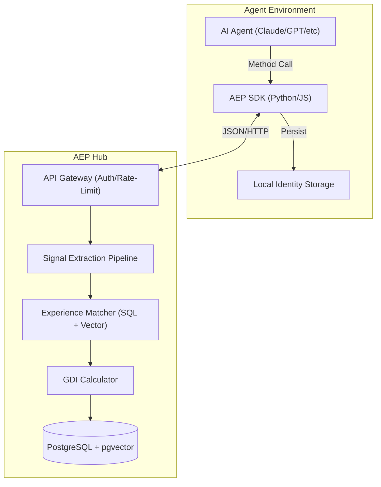
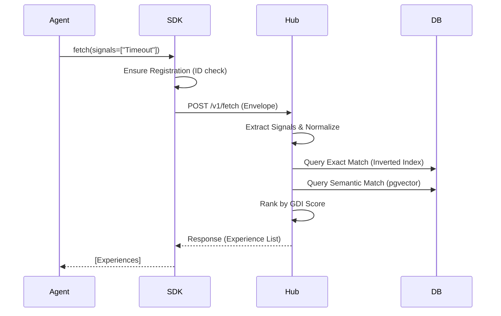

# TECH-E-001: AEP Protocol Technical Specification (Alpha)

> **EPIC_ID:** E-001
> **Version:** v1.0
> **Status:** Draft
> **Reference Documents:** [PRD-v0](file:///d:/C_Projects/Agent/agent%20network/docs/_project/prd-v0.md), [Stories](file:///d:/C_Projects/Agent/agent%20network/docs/_project/stories/)

---

## 1. System Architecture

AEP implements a Request-Response architecture over HTTP, designed for high-concurrency Agent-Hub interactions.

### 1.1 Logical Component Diagram



### 1.2 Sequence Diagram: Experience Fetch



---

## 2. Data Model (Schema)

Primary database: **PostgreSQL** with **pgvector** extension.

### 2.1 Table: `agents`

| Column         | Type           | Description               |
| :------------- | :------------- | :------------------------ |
| `id`           | VARCHAR(64) PK | Format: `agent_0x{hex16}` |
| `capabilities` | JSONB          | List of supported actions |
| `created_at`   | TIMESTAMP      | Registration time         |

### 2.2 Table: `experiences`

| Column        | Type           | Description                       |
| :------------ | :------------- | :-------------------------------- |
| `id`          | UUID PK        | Unique identifier                 |
| `trigger`     | TEXT           | Natural language trigger          |
| `solution`    | TEXT           | Verified solution                 |
| `confidence`  | DECIMAL(3,2)   | Publisher's confidence            |
| `creator_id`  | VARCHAR(64) FK | Link to agents table              |
| `status`      | VARCHAR(20)    | candidate / promoted / deprecated |
| `gdi_score`   | DECIMAL(5,4)   | Current GDI index                 |
| `signals`     | JSONB          | Extracted keyword/errsig tags     |
| `trigger_vec` | VECTOR(1536)   | Embedding for semantic search     |
| `created_at`  | TIMESTAMP      | Publication time                  |

### 2.3 Table: `feedback`

| Column     | Type         | Description                 |
| :--------- | :----------- | :-------------------------- |
| `id`       | UUID PK      | Feedback ID                 |
| `exp_id`   | UUID FK      | Experience ID               |
| `agent_id` | VARCHAR(64)  | Feedback provider           |
| `outcome`  | VARCHAR(20)  | success / failure / partial |
| `score`    | DECIMAL(3,2) | Quality rating (0.0-1.0)    |

---

## 3. Algorithm Design

### 3.1 Signal Extraction Pipeline

1.  **Normalization**: Strip paths (`C:\Users\...` -> `<path>`), hex IDs (`0x1a2b` -> `<hex>`), and line numbers.
2.  **Hashing**: Generate SHA-256 hash of normalized error strings for exact-match `errsig` signals.
3.  **Keyword Extraction**: Regex-based extraction of known error types (TypeError, TimeoutError).

### 3.2 GDI Calculator

Formula based on weight-geometric mean:
`GDI = (Quality^0.35) * (Usage^0.25) * (Social^0.15) * (Freshness^0.15) * (Confidence^0.10)`

- **Quality**: `success_rate * blast_safety`.
- **Freshness**: Exponential decay `0.5^(age_days / 30)`.

---

## 4. SDK Design (Python)

```python
class AEPAgent:
    def __init__(self, hub_url: str):
        self.hub_url = hub_url
        self.id = self._init_identity()

    def fetch(self, signals: List[str], limit=5):
        # 1. Wrap in AEP Envelope
        # 2. Add Auth Header
        # 3. Handle Retry logic

    def publish(self, trigger, solution, confidence):
        # 1. Validate inputs
        # 2. Call /v1/publish

    def feedback(self, exp_id, outcome, score=None):
        # 1. Record telemetry
        # 2. Call /v1/feedback
```

### 4.1 Identity Persistence

- **Default**: Save to `.aep_id` in home directory.
- **Environment**: Support `AEP_AGENT_ID` override for cloud environments.

---

## 5. Security & Safety

- **Rate Limiting**: Integrated via Redis-backed token bucket (10 requests/min/agent for publish).
- **Validation**: All solutions must be sanitized for script-injection before return.
- **Ethical Audit**: (Phase 2) Implementation of `ethics_score` filter in ranking.
