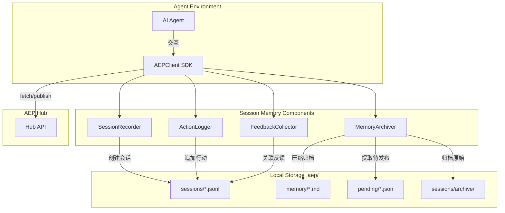

# TECH-E-004: Session Memory Technical Specification

> **EPIC_ID:** E-004
> **EPIC_DIR:** `E-004-Session-Memory`
> **Version:** v1.0
> **Status:** DRAFT
> **Author:** AEP Protocol Team
> **Date:** 2026-02-23
>
> **关联文档：**
> - biz：`/docs/_project/biz-overview.md`
> - prd：`/docs/_project/prd-v1-session-memory.md`
> - project baseline：`/docs/_project/tech-baseline.md`

---

## 1. 目标与范围对齐

### 1.1 目标（来自 PRD）

1. **可追溯性**：智能体的每一次行动都有记录，支持审计和复盘
2. **数据完整性**：行动记录与反馈关联，形成完整的经验闭环
3. **存储规范化**：统一存储位置，跨工具/环境可访问
4. **自动化压缩**：长会话自动压缩为摘要，保持可读性

### 1.2 Out of Scope（来自 PRD）

| 功能 | 原因 |
|------|------|
| 实时流式上传 | 复杂度高，先做本地存储 |
| 多智能体会话合并 | 需要协调机制 |
| 加密存储 | 安全需求明确后再做 |
| 云端同步 | 需要账户系统 |

### 1.3 验收口径摘要（来自 PRD AC）

| AC ID | 验收标准 |
|-------|----------|
| AC-1 | 每次智能体交互都被记录为 AgentAction |
| AC-2 | AgentAction 格式符合接口定义 |
| AC-3 | 显式反馈正确关联到对应 AgentAction |
| AC-4 | 隐式反馈正确推断和关联 |
| AC-5 | 会话结束后生成压缩摘要 |
| AC-6 | 待发布队列正确管理 Experience |
| AC-7 | 存储位置符合统一规范 |
| AC-8 | 记录延迟 < 100ms (p95) |

---

## 2. 现状与约束

### 2.1 相关代码/系统现状

**现有 SDK 结构**：
- Python SDK：`aep-sdk/src/aep_sdk/client.py` - AEPClient 核心客户端
- TypeScript 模块：`src/aep/` - 信号提取、匹配器、GDI 计算等
- 数据模型：`aep-sdk/src/aep_sdk/models.py` - Experience, PublishResult, FeedbackResult

**关键模块**：
- `src/aep/signal/index.ts:369-438` - SignalExtractor 信号提取
- `src/aep/fetch/index.ts:267-503` - FetchHandler 请求处理
- `aep-sdk/src/aep_sdk/client.py:55-740` - AEPClient SDK 客户端

**现有数据流**：
```
Agent → SDK → Hub → DB
       ↓
    (无本地记录)
```

### 2.2 复用清单

**可复用能力/组件**：

| 组件 | 路径 | 说明 |
|------|------|------|
| AgentIdentityStore | `aep-sdk/src/aep_sdk/identity.py` | 智能体身份持久化，可复用存储模式 |
| Experience 模型 | `aep-sdk/src/aep_sdk/models.py:12-71` | 可扩展为 AgentAction 基础结构 |
| 信号提取 | `src/aep/signal/index.ts` | 可复用 trigger/solution 生成逻辑 |

**需要扩展的既有能力**：

| 组件 | 路径 | 扩展点 |
|------|------|--------|
| AEPClient | `aep-sdk/src/aep_sdk/client.py` | 增加 SessionRecorder、ActionLogger、FeedbackCollector |
| 数据模型 | `aep-sdk/src/aep_sdk/models.py` | 增加 AgentAction、Session、Feedback 数据类 |

**不复用的理由**：
- 现有 Hub API 是同步 HTTP，不适合本地日志流式写入
- 需要独立的本地存储层，不依赖网络

### 2.3 硬约束

**技术基线约束**：
- Python SDK 支持 Python 3.8+
- TypeScript 模块使用 ES Modules
- 本地文件存储（JSONL 格式）
- 无外部数据库依赖

**合规/隐私约束**：
- 会话记录存储在用户本地工作空间
- 敏感信息支持标记为 `redacted`
- 上传到 Hub 前需用户确认

**交付约束**：
- 记录延迟 < 100ms（不阻塞主流程）
- 压缩比 >= 70%

---

## 3. 方案总览

### 3.1 方案一句话

> 在 AEP SDK 中增加三层本地存储（sessions/memory/pending），通过 SessionRecorder、ActionLogger、FeedbackCollector 三个组件实现智能体行动的自动记录、反馈关联和压缩归档。

### 3.2 架构变化概览

```
现有架构：
Agent → AEPClient → Hub
          ↓
      (无本地记录)

新增架构：
Agent → AEPClient → Hub
          │
          ├── SessionRecorder  → .aep/sessions/*.jsonl
          ├── ActionLogger     → (追加到 session 文件)
          ├── FeedbackCollector → (更新 action.feedback)
          └── MemoryArchiver   → .aep/memory/*.md
                                   .aep/pending/*.json
```

### 3.3 关键 Trade-off

| 决策 | 选择 | 替代方案 | 玟理由 |
|------|------|----------|--------|
| 存储格式 | JSONL | SQLite | 简单、可读、跨语言 |
| 压缩策略 | 规则摘要 | LLM 摘要 | 无依赖、成本低 |
| 反馈关联 | ID 引用 | 时间窗口 | 精确、无歧义 |
| 写入时机 | 同步追加 | 异步队列 | 简单、无丢数据风险 |

### 3.4 影响面

- **SDK API**：AEPClient 增加 `start_session()`, `log_action()`, `collect_feedback()`, `archive_session()` 方法
- **存储**：在工作空间创建 `.aep/` 目录结构
- **无 Hub 影响**：所有功能本地完成，不影响现有 Hub API

### 3.5 架构图



---

## 4. 详细设计

### 4.1 模块/服务边界与职责

| 模块 | 职责 | 输入 | 输出 |
|------|------|------|------|
| **SessionRecorder** | 管理会话生命周期 | 会话配置 | session_id, JSONL 文件 |
| **ActionLogger** | 记录智能体行动 | AgentAction 数据 | 追加到 JSONL |
| **FeedbackCollector** | 收集并关联反馈 | action_id, 反馈数据 | 更新 JSONL 行 |
| **MemoryArchiver** | 压缩归档会话 | session_id | summary.md, pending.json |
| **StorageManager** | 文件系统操作 | 文件路径 | 文件内容 |

### 4.2 数据模型与迁移策略

#### 4.2.1 AgentAction 接口（TypeScript/Python）

```typescript
// TypeScript 定义
interface AgentAction {
  // 基础信息
  id: string;                    // UUID
  timestamp: string;             // ISO 8601

  // 行动类型
  action_type: 'tool_call' | 'message' | 'decision';

  // 核心内容
  trigger: string;               // 遇到什么问题
  solution: string;              // 采取什么行动
  result: 'success' | 'failure' | 'partial';

  // 上下文
  context: {
    session_id: string;
    parent_action_id?: string;
    workspace?: string;
    model?: string;
    tools_used?: string[];
    [key: string]: any;
  };

  // 反馈（后续填充）
  feedback?: {
    type: 'explicit' | 'implicit';
    value: 'positive' | 'negative' | 'neutral';
    score?: number;              // 0-1
    source?: string;
    timestamp: string;
  };

  // 元数据
  metadata?: {
    duration_ms?: number;
    tokens_used?: number;
    confidence?: number;
    [key: string]: any;
  };
}
```

```python
# Python 定义 (aep_sdk/models.py 扩展)
@dataclass
class AgentAction:
    id: str
    timestamp: str
    action_type: str  # 'tool_call' | 'message' | 'decision'
    trigger: str
    solution: str
    result: str  # 'success' | 'failure' | 'partial'
    context: Dict[str, Any]
    feedback: Optional[Dict[str, Any]] = None
    metadata: Optional[Dict[str, Any]] = None

    def to_jsonl(self) -> str:
        """转换为 JSONL 行"""
        return json.dumps(self.__dict__, ensure_ascii=False)
```

#### 4.2.2 Session 接口

```typescript
interface Session {
  id: string;                    // session_<timestamp>_<random>
  workspace: string;             // 工作空间路径
  agent_id: string;              // 智能体 ID
  started_at: string;            // ISO 8601
  ended_at?: string;             // ISO 8601
  status: 'active' | 'paused' | 'completed' | 'archived';
  action_count: number;
  file_path: string;             // JSONL 文件路径
}
```

#### 4.2.3 存储目录结构

```
<workspace>/.aep/
├── agent.json              # 智能体身份信息
├── sessions/               # 会话记录
│   ├── session_20260223_abc123.jsonl
│   └── archive/            # 已归档会话
│       └── session_20260220_xyz789.jsonl.gz
├── memory/                 # 压缩记忆
│   ├── 2026-02-23_summary.md
│   └── session_20260223_abc123_summary.md
├── pending/                # 待发布队列
│   ├── exp_001.json
│   └── batch_20260223.json
└── cache/                  # 本地缓存
    ├── experiences.json
    └── signals.json
```

#### 4.2.4 迁移策略

- **无迁移**：首次使用时创建目录结构
- **兼容性**：如果 `.aep/` 不存在，自动创建
- **无破坏性变更**：不影响现有 Hub 数据

### 4.3 API / 接口设计

#### 4.3.1 SDK API 扩展（Python）

**SessionRecorder API**：

```python
class SessionRecorder:
    def __init__(self, workspace: str, agent_id: str):
        """初始化会话记录器"""

    def start_session(self, metadata: Optional[Dict] = None) -> str:
        """
        开始新会话，返回 session_id

        Returns:
            session_id: 格式 session_<timestamp>_<random>
        """

    def get_active_session(self) -> Optional[str]:
        """获取当前活跃会话 ID"""

    def end_session(self, session_id: str) -> str:
        """
        结束会话，返回 JSONL 文件路径

        Returns:
            file_path: 会话文件完整路径
        """
```

**ActionLogger API**：

```python
class ActionLogger:
    def __init__(self, session_recorder: SessionRecorder):
        """初始化行动日志器"""

    def log_action(self, action: AgentAction) -> str:
        """
        记录行动，返回 action_id

        Args:
            action: AgentAction 对象

        Returns:
            action_id: 行动唯一标识

        Raises:
            SessionNotActiveError: 会话未激活
            WriteError: 写入失败
        """

    def log_tool_call(
        self,
        tool_name: str,
        trigger: str,
        solution: str,
        result: str,
        context: Optional[Dict] = None
    ) -> str:
        """便捷方法：记录工具调用"""

    def log_message(
        self,
        trigger: str,
        solution: str,
        result: str,
        context: Optional[Dict] = None
    ) -> str:
        """便捷方法：记录消息"""

    def log_decision(
        self,
        trigger: str,
        solution: str,
        result: str,
        context: Optional[Dict] = None
    ) -> str:
        """便捷方法：记录决策"""
```

**FeedbackCollector API**：

```python
class FeedbackCollector:
    def __init__(self, action_logger: ActionLogger):
        """初始化反馈收集器"""

    def collect_explicit_feedback(
        self,
        action_id: str,
        value: str,  # 'positive' | 'negative' | 'neutral'
        score: Optional[float] = None,
        source: Optional[str] = None
    ) -> bool:
        """
        收集显式反馈

        Args:
            action_id: 行动 ID
            value: 反馈值
            score: 可选评分 0-1
            source: 反馈来源（如 'user_click', 'user_rating'）

        Returns:
            是否成功关联
        """

    def collect_implicit_feedback(
        self,
        action_id: str,
        value: str,
        evidence: Optional[str] = None
    ) -> bool:
        """
        收集隐式反馈

        Args:
            action_id: 行动 ID
            value: 反馈值
            evidence: 推断依据（如 'user_accepted_suggestion'）

        Returns:
            是否成功关联
        """
```

**MemoryArchiver API**：

```python
class MemoryArchiver:
    def __init__(self, workspace: str):
        """初始化归档器"""

    def archive_session(self, session_id: str) -> ArchiveResult:
        """
        归档会话

        Returns:
            ArchiveResult:
                - summary_path: 摘要文件路径
                - pending_experiences: 待发布经验列表
                - archived_path: 归档文件路径（压缩）
        """

    def compress_actions(
        self,
        actions: List[AgentAction]
    ) -> SessionSummary:
        """
        压缩行动列表为摘要

        Returns:
            SessionSummary:
                - user_intent: 用户意图
                - main_problems: 主要问题列表
                - successful_solutions: 成功方案列表
                - failed_attempts: 失败尝试列表
                - feedback_summary: 反馈总结
                - metrics: 耗时/token 统计
        """

    def extract_pending_experiences(
        self,
        actions: List[AgentAction]
    ) -> List[PendingExperience]:
        """
        提取待发布经验

        Returns:
            待发布经验列表（成功 + 正面反馈）
        """
```

#### 4.3.2 AEPClient 集成 API

```python
class AEPClient:
    # 现有方法保持不变...

    # 新增：Session Memory API
    def start_session(self, metadata: Optional[Dict] = None) -> str:
        """开始新会话"""

    def log_action(
        self,
        action_type: str,
        trigger: str,
        solution: str,
        result: str,
        context: Optional[Dict] = None,
        metadata: Optional[Dict] = None
    ) -> str:
        """记录行动"""

    def collect_feedback(
        self,
        action_id: str,
        feedback_type: str,
        value: str,
        score: Optional[float] = None,
        source: Optional[str] = None
    ) -> bool:
        """收集反馈"""

    def end_session(self) -> Dict[str, Any]:
        """结束会话并归档"""

    def get_pending_experiences(self) -> List[Dict]:
        """获取待发布经验"""

    def publish_pending(self, batch: Optional[List[str]] = None) -> List[PublishResult]:
        """发布待发布经验"""
```

#### 4.3.3 接口契约汇总

| API | 方法 | 请求 | 响应 | 错误码 |
|-----|------|------|------|--------|
| start_session | POST | metadata? | session_id | SESSION_ERROR |
| log_action | POST | AgentAction | action_id | SESSION_NOT_ACTIVE, WRITE_ERROR |
| collect_feedback | POST | action_id, feedback | success | ACTION_NOT_FOUND |
| end_session | POST | session_id | summary_path, pending_count | SESSION_NOT_FOUND |
| archive_session | POST | session_id | ArchiveResult | SESSION_NOT_FOUND |

### 4.4 安全 / 权限 / 审计

**本地存储安全**：
- 所有数据存储在用户工作空间（用户可控）
- 敏感信息标记 `redacted: true`，不记录原始值
- 文件权限：仅当前用户可读写

**审计日志**：
- 每个行动记录包含 `timestamp` 和 `agent_id`
- 支持按时间范围查询历史会话

**隐私保护**：
- 敏感字段自动检测（密码、密钥、token）
- 发布前需用户确认，默认不自动上传

### 4.5 可观测性（工程侧）

**日志**：
```
[INFO] Session started: session_20260223_abc123
[DEBUG] Action logged: action_001 (tool_call)
[INFO] Feedback collected: action_001 -> positive
[INFO] Session archived: session_20260223_abc123 -> 15 pending experiences
```

**指标**：
- `aep_session_count`: 会话总数
- `aep_action_count`: 行动总数（按 type 分组）
- `aep_feedback_rate`: 反馈关联率
- `aep_archive_size`: 归档文件大小
- `aep_pending_count`: 待发布数量

**告警**：
- 磁盘空间 < 1GB
- 写入失败 > 3 次
- 会话超时 > 24h

### 4.6 失败模式与可靠性

**写入失败处理**：
1. 重试 3 次（间隔 100ms/200ms/400ms）
2. 失败后写入内存队列
3. 下次会话恢复时重试

**磁盘空间不足**：
1. 检测剩余空间 < 1GB
2. 停止新记录
3. 提示用户清理

**文件损坏**：
1. 跳过损坏行
2. 记录错误日志
3. 继续处理后续行

---

## 5. 上线策略

### 5.1 Feature Flag

- `AEP_SESSION_MEMORY_ENABLED`: 是否启用会话记录（默认 true）
- `AEP_AUTO_ARCHIVE`: 是否自动归档（默认 true）
- `AEP_AUTO_PUBLISH`: 是否自动发布待发布经验（默认 false）

### 5.2 回滚策略

- 关闭 Feature Flag 即可禁用新功能
- 已存储的数据保留，不影响 Hub
- 可手动删除 `.aep/` 目录清理

### 5.3 灰度策略

1. **阶段 1**：开发者自测（1 周）
2. **阶段 2**：内部用户（1 周）
3. **阶段 3**：全量开放

---

## 6. 风险、未决项与升级点

### 6.1 风险

| 风险 | 等级 | 缓解措施 |
|------|------|----------|
| 磁盘空间占用大 | M | 自动清理策略、压缩归档 |
| 记录延迟影响主流程 | M | 异步写入选项 |
| 敏感信息泄露 | H | 敏感标记、发布前确认 |

### 6.2 未决项 [OPEN]

| ID | 问题 | 责任方 | 目标日期 |
|----|------|--------|----------|
| OPEN-1 | 隐式反馈推断阈值 | 产品 | 2026-02-28 |
| OPEN-2 | 敏感信息自动检测规则 | 安全 | 2026-03-01 |
| OPEN-3 | 压缩摘要格式标准 | 产品 | 2026-02-28 |

### 6.3 需要升级

- **升级 prd**：OPEN-1 隐式反馈规则需要产品确认
- **升级 biz-owner**：OPEN-2 敏感信息规则需要安全评审

---

## 7. 任务拆解建议

### 7.1 任务依赖与并行可行性分析

| TASK_ID | 依赖类型 | 依赖任务 | 可并行 | 说明 |
|---------|----------|----------|--------|------|
| SESSION-001 | 无 | - | YES | 数据模型定义，完全独立 |
| SESSION-002 | 硬依赖 | SESSION-001 | NO | SessionRecorder 需要数据模型 |
| SESSION-003 | 硬依赖 | SESSION-002 | NO | ActionLogger 需要 SessionRecorder |
| ACTION-001 | 硬依赖 | SESSION-001 | YES* | 可并行定义接口，实现等 SESSION-002 |
| ACTION-002 | 硬依赖 | ACTION-001 | NO | 需要基础日志器 |
| ACTION-003 | 硬依赖 | ACTION-002 | NO | 需要完整日志器 |
| FEEDBACK-001 | 硬依赖 | SESSION-001 | YES* | 可并行定义反馈模型 |
| FEEDBACK-002 | 硬依赖 | ACTION-002, FEEDBACK-001 | NO | 需要日志器和模型 |
| FEEDBACK-003 | 硬依赖 | FEEDBACK-002 | NO | 需要完整收集器 |
| ARCHIVE-001 | 硬依赖 | SESSION-001 | YES* | 可并行定义摘要格式 |
| ARCHIVE-002 | 硬依赖 | SESSION-003, ARCHIVE-001 | NO | 需要完整会话数据 |
| ARCHIVE-003 | 硬依赖 | ARCHIVE-002 | NO | 需要压缩功能 |

**并行策略**：
- **第一批（立即可并行）**：SESSION-001, ACTION-001, FEEDBACK-001, ARCHIVE-001（数据模型定义）
- **第二批（等第一批）**：SESSION-002, SESSION-003
- **第三批（等第二批）**：ACTION-002, ACTION-003, FEEDBACK-002, FEEDBACK-003, ARCHIVE-002, ARCHIVE-003

### 7.2 建议任务列表

**P0 - 核心功能（MVP）**：
- `TASK-E-004-SESSION-001`：定义 AgentAction/Session 数据模型
- `TASK-E-004-SESSION-002`：实现 SessionRecorder 会话管理
- `TASK-E-004-SESSION-003`：实现 ActionLogger 行动日志
- `TASK-E-004-ACTION-001`：实现 tool_call 类型日志
- `TASK-E-004-ACTION-002`：实现 message 类型日志
- `TASK-E-004-ACTION-003`：实现 decision 类型日志

**P0 - 反馈闭环**：
- `TASK-E-004-FEEDBACK-001`：定义 Feedback 数据模型
- `TASK-E-004-FEEDBACK-002`：实现 FeedbackCollector 显式反馈
- `TASK-E-004-FEEDBACK-003`：实现 FeedbackCollector 隐式反馈

**P1 - 压缩归档**：
- `TASK-E-004-ARCHIVE-001`：定义 SessionSummary 摘要格式
- `TASK-E-004-ARCHIVE-002`：实现 MemoryArchiver 压缩归档
- `TASK-E-004-ARCHIVE-003`：实现待发布队列管理

### 7.3 代码修改清单

#### 数据/模型层
- [ ] `aep-sdk/src/aep_sdk/models.py` 添加 AgentAction, Session, Feedback, SessionSummary 类

#### SDK 客户端层
- [ ] `aep-sdk/src/aep_sdk/client.py` AEPClient 增加会话管理方法

#### 新增模块
- [ ] `aep-sdk/src/aep_sdk/session/recorder.py` SessionRecorder 实现
- [ ] `aep-sdk/src/aep_sdk/session/logger.py` ActionLogger 实现
- [ ] `aep-sdk/src/aep_sdk/session/feedback.py` FeedbackCollector 实现
- [ ] `aep-sdk/src/aep_sdk/session/archive.py` MemoryArchiver 实现
- [ ] `aep-sdk/src/aep_sdk/session/storage.py` StorageManager 实现

#### 测试层
- [ ] `aep-sdk/tests/test_session_recorder.py` 会话管理测试
- [ ] `aep-sdk/tests/test_action_logger.py` 行动日志测试
- [ ] `aep-sdk/tests/test_feedback_collector.py` 反馈收集测试
- [ ] `aep-sdk/tests/test_memory_archiver.py` 压缩归档测试

---

## 8. 与基线冲突

**无冲突**：本方案完全在现有技术基线内实现，不引入新的依赖或架构变更。

---

## 9. TECH 文档质量检查清单

### 9.1 内容结构检查
- [x] 包含架构图（Mermaid）
- [x] 复用清单清晰列出可复用组件
- [x] 明确标注 [OPEN] 未决项
- [x] 接口定义完整

### 9.2 代码占比检查
- [x] 代码块占比 < 30%（仅接口定义和关键伪代码）
- [x] 所有代码通过文件路径引用
- [x] 未粘贴完整实现代码

### 9.3 可落地性检查
- [x] TASK 拆解可执行
- [x] 依赖关系清晰
- [x] 风险和未决项显式标注
- [x] 迁移和回滚方案可行

### 9.4 文档一致性检查
- [x] 引用了上游文档（biz/prd）
- [x] 与项目基线保持一致
- [x] 术语与上游文档一致
