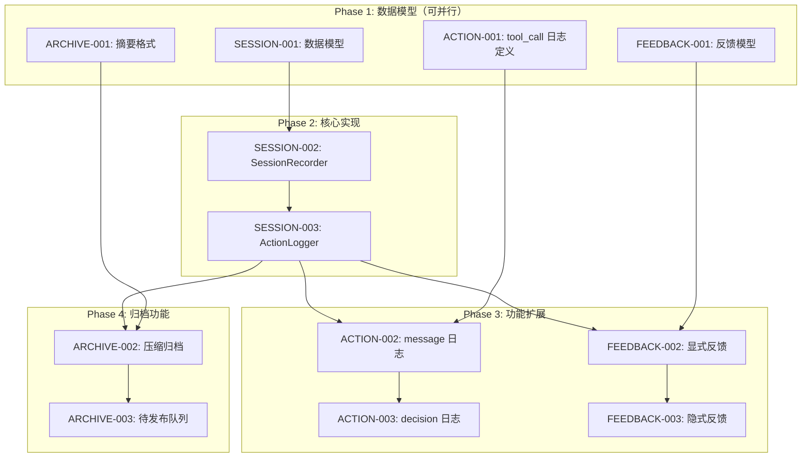

# E-004 Session Memory - Task Dependencies

> 文档路径：`/docs/E-004-Session-Memory/tech/task-dependencies.md`
> 创建日期：2026-02-23
> 版本：v1.0

---

## 1. 任务概览

本 Epic 共 12 个任务，分为 4 个模块：

| 模块 | 任务数 | 优先级 | 说明 |
|------|--------|--------|------|
| SESSION | 3 | P0 | 会话记录核心 |
| ACTION | 3 | P0 | 行动日志类型 |
| FEEDBACK | 3 | P0 | 反馈收集 |
| ARCHIVE | 3 | P1 | 压缩归档 |

---

## 2. 任务依赖图



---

## 3. 依赖类型说明

### 3.1 硬依赖（代码必须）

**定义**：代码直接 import 了其他任务的模块，必须等待实现完成才能开始。

**标记**：`deps: [TASK-XXX]`

**规则**：禁止 mock，必须等实现完成

**示例**：
- SESSION-003 硬依赖 SESSION-002（ActionLogger 必须调用 SessionRecorder）
- FEEDBACK-002 硬依赖 ACTION-002（FeedbackCollector 必须更新 ActionLogger）

### 3.2 接口依赖（联调需要）

**定义**：只需要调用接口，不依赖具体实现，可以先按契约开发。

**标记**：`interface_deps: [TASK-XXX]`

**规则**：允许契约先行，但类型必须对齐

**示例**：
- ACTION-001 接口依赖 SESSION-001（需要 AgentAction 类型定义）

### 3.3 无依赖

**定义**：完全独立，可立即启动。

**标记**：`deps: []`

**示例**：
- SESSION-001 无依赖（纯数据模型定义）

---

## 4. 任务详细依赖表

| TASK_ID | 任务名称 | 硬依赖 | 接口依赖 | 预估工期 | 并行批次 |
|---------|----------|--------|----------|----------|----------|
| SESSION-001 | AgentAction/Session 数据模型 | - | - | 4h | 1 |
| SESSION-002 | SessionRecorder 实现 | SESSION-001 | - | 6h | 2 |
| SESSION-003 | ActionLogger 实现 | SESSION-002 | - | 6h | 3 |
| ACTION-001 | tool_call 日志 | SESSION-001 | SESSION-002 | 3h | 1*/3 |
| ACTION-002 | message 日志 | ACTION-001, SESSION-003 | - | 2h | 4 |
| ACTION-003 | decision 日志 | ACTION-002 | - | 2h | 5 |
| FEEDBACK-001 | Feedback 数据模型 | - | - | 2h | 1 |
| FEEDBACK-002 | 显式反馈收集 | FEEDBACK-001, SESSION-003 | - | 4h | 4 |
| FEEDBACK-003 | 隐式反馈收集 | FEEDBACK-002 | - | 4h | 5 |
| ARCHIVE-001 | SessionSummary 摘要格式 | - | - | 3h | 1 |
| ARCHIVE-002 | MemoryArchiver 压缩归档 | ARCHIVE-001, SESSION-003 | - | 6h | 4 |
| ARCHIVE-003 | 待发布队列管理 | ARCHIVE-002 | - | 4h | 5 |

**并行批次说明**：
- 批次 1：SESSION-001, ACTION-001(定义), FEEDBACK-001, ARCHIVE-001 可并行
- 批次 2：SESSION-002（等 SESSION-001）
- 批次 3：SESSION-003, ACTION-001(实现)（等批次 2）
- 批次 4：ACTION-002, FEEDBACK-002, ARCHIVE-002（等批次 3）
- 批次 5：ACTION-003, FEEDBACK-003, ARCHIVE-003（等批次 4）

---

## 5. 接口契约汇总

### 5.1 SESSION-001 输出契约

```python
# aep_sdk/models.py

@dataclass
class AgentAction:
    id: str
    timestamp: str
    action_type: str  # 'tool_call' | 'message' | 'decision'
    trigger: str
    solution: str
    result: str  # 'success' | 'failure' | 'partial'
    context: Dict[str, Any]
    feedback: Optional[Dict[str, Any]] = None
    metadata: Optional[Dict[str, Any]] = None

@dataclass
class Session:
    id: str
    workspace: str
    agent_id: str
    started_at: str
    ended_at: Optional[str]
    status: str
    action_count: int
    file_path: str
```

### 5.2 SESSION-002 输出契约

```python
# aep_sdk/session/recorder.py

class SessionRecorder:
    def start_session(self, metadata: Optional[Dict] = None) -> str:
        """返回 session_id"""

    def get_active_session(self) -> Optional[str]:
        """返回当前活跃 session_id"""

    def end_session(self, session_id: str) -> str:
        """返回 JSONL 文件路径"""

    def get_session_file(self, session_id: str) -> str:
        """返回会话文件路径"""
```

### 5.3 SESSION-003 输出契约

```python
# aep_sdk/session/logger.py

class ActionLogger:
    def log_action(self, action: AgentAction) -> str:
        """返回 action_id"""

    def log_tool_call(self, tool_name: str, trigger: str,
                      solution: str, result: str,
                      context: Optional[Dict] = None) -> str:
        """返回 action_id"""

    def log_message(self, trigger: str, solution: str,
                    result: str, context: Optional[Dict] = None) -> str:
        """返回 action_id"""

    def log_decision(self, trigger: str, solution: str,
                     result: str, context: Optional[Dict] = None) -> str:
        """返回 action_id"""
```

### 5.4 FEEDBACK-001 输出契约

```python
# aep_sdk/models.py 扩展

@dataclass
class Feedback:
    action_id: str
    type: str  # 'explicit' | 'implicit'
    value: str  # 'positive' | 'negative' | 'neutral'
    score: Optional[float] = None  # 0-1
    source: Optional[str] = None
    timestamp: str = field(default_factory=lambda: datetime.now().isoformat())
```

### 5.5 ARCHIVE-001 输出契约

```python
# aep_sdk/models.py 扩展

@dataclass
class SessionSummary:
    session_id: str
    user_intent: str
    main_problems: List[str]
    successful_solutions: List[str]
    failed_attempts: List[str]
    feedback_summary: Dict[str, int]
    metrics: Dict[str, Any]

@dataclass
class PendingExperience:
    id: str
    trigger: str
    solution: str
    confidence: float
    source_action_id: str
    feedback_score: Optional[float]
```

---

## 6. 并行开发策略

### 6.1 第一批（立即启动）

**任务**：SESSION-001, FEEDBACK-001, ARCHIVE-001

**策略**：
1. 这三个任务都是数据模型定义，完全独立
2. 完成后提供类型定义给后续任务
3. 预计 4 小时内完成

### 6.2 第二批（等第一批）

**任务**：SESSION-002

**策略**：
1. 等待 SESSION-001 完成
2. ACTION-001 可先定义接口（依赖 SESSION-001 类型）

### 6.3 第三批（等第二批）

**任务**：SESSION-003, ACTION-001(实现)

**策略**：
1. SESSION-003 等待 SESSION-002
2. ACTION-001 的实现部分等待 SESSION-003

### 6.4 第四批（等第三批）

**任务**：ACTION-002, FEEDBACK-002, ARCHIVE-002

**策略**：
1. 三个任务可并行开发
2. 都依赖 SESSION-003 的 ActionLogger

### 6.5 第五批（等第四批）

**任务**：ACTION-003, FEEDBACK-003, ARCHIVE-003

**策略**：
1. 三个任务可并行开发
2. 分别依赖第四批的对应任务

---

## 7. 风险与注意事项

### 7.1 关键路径

**最短工期计算**：
```
批次 1 (4h) → 批次 2 (6h) → 批次 3 (6h) → 批次 4 (6h) → 批次 5 (4h)
总计：26 小时（约 3-4 个工作日）
```

### 7.2 阻塞风险

| 风险 | 影响 | 缓解措施 |
|------|------|----------|
| SESSION-001 延迟 | 阻塞所有后续任务 | 优先完成，最小化范围 |
| SESSION-002/003 延迟 | 阻塞批次 4-5 | 提前定义接口契约，允许桩实现 |
| 接口变更 | 影响下游任务 | 使用版本化接口，变更需同步 |

### 7.3 质量检查点

| 检查点 | 时机 | 检查内容 |
|--------|------|----------|
| 模型一致性 | 批次 1 完成后 | 所有数据模型类型一致 |
| 接口契约 | 批次 3 完成后 | 接口与实现一致 |
| 集成测试 | 批次 4 完成后 | 端到端流程验证 |
| 压力测试 | 批次 5 完成后 | 性能指标验证 |

---

## 8. 变更记录

| 版本 | 日期 | 修改人 | 修改内容 |
|------|------|--------|----------|
| v1.0 | 2026-02-23 | AEP Protocol Team | 初版 |
